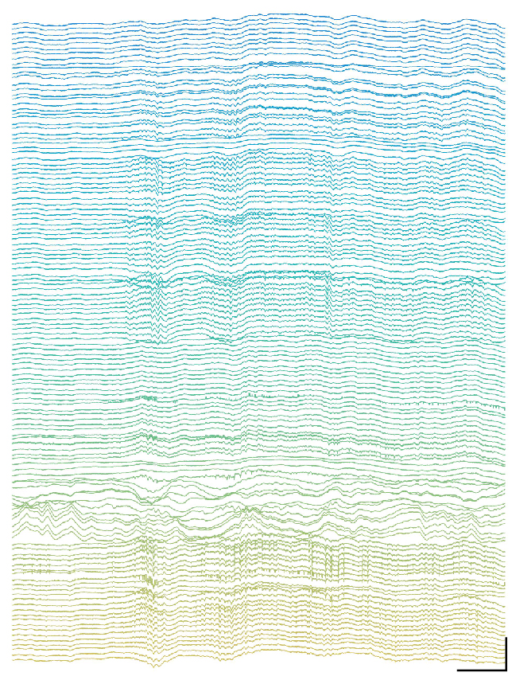

---
hide:
  - navigation
  - toc
---

<section class="wild-hero">
  <div>
    <h1>WILD: Wireless neuro-behavioral recording and closed-loop manipulation in freely moving animals</h1>
    <p>The Wireless, Interactive, Lightweight Datalogger (WILD) is an ultra-lightweight multimodal neurologger for local electrophysiology, behavioral sensing, embedded processing, and responsive stimulation in freely behaving small animals.</p>
    <div class="wild-actions">
      <a class="md-button md-button--primary" href="getting-started/">Get Started</a>
      <a class="md-button" href="hardware/">Hardware</a>
      <a class="md-button" href="software/">Software</a>
      <a class="md-button" href="https://github.com/ayalab1/Neurologger">GitHub</a>
    </div>
    <div class="wild-signal-row">
      <span>64-channel electrophysiology</span>
      <span>Closed-loop DSP</span>
      <span>9-axis IMU</span>
      <span>USV audio</span>
      <span>Head-mounted camera</span>
    </div>
  </div>
  <div class="wild-hero-media wild-hero-media-tiled">
    <figure class="wild-hero-tile wild-hero-device-tile">
      
      <figcaption class="wild-caption">WILD integrates local neural recording, behavioral monitoring, embedded processing, microSD storage, wireless control, and stimulation support in a compact head-mounted platform.</figcaption>
    </figure>
    <figure class="wild-hero-tile wild-hero-ephys-tile">
      
    </figure>
  </div>
</section>

<section class="wild-section wild-paper-banner">
  <h2>Nature Methods platform paper</h2>
  <p>WILD was developed to make high-channel-count neural recording, multimodal behavioral monitoring, and closed-loop perturbation feasible during naturalistic behavior without tethered acquisition hardware.</p>
  <p>Use this site to reproduce the public 64-channel WILD workflow, locate hardware and software assets, and document the release image, hardware revision, WILD_console version, SD card, battery, and analysis scripts used for each dataset.</p>
</section>

<section class="wild-section">
  <h2>Why WILD?</h2>
  <div class="wild-grid">
    <div class="wild-card">
      <h3>Naturalistic neuroscience</h3>
      <p>Record neural activity while animals explore, interact socially, vocalize, or move through large environments where tethered systems are limiting.</p>
    </div>
    <div class="wild-card">
      <h3>Local full-resolution recording</h3>
      <p>High-bandwidth neural and multimodal data are written to onboard microSD storage. BLE is used for discovery, configuration, synchronization support, status, preview, and commands.</p>
    </div>
    <div class="wild-card">
      <h3>Closed-loop control</h3>
      <p>Embedded DSP and curated TinyML workflows support device-local detection and responsive stimulation without requiring continuous full-bandwidth wireless streaming.</p>
    </div>
    <div class="wild-card">
      <h3>Open and reproducible</h3>
      <p>Hardware files, release images, WILD_console installers, MATLAB scripts, Python tools, and documentation are maintained in the public repository.</p>
    </div>
  </div>
</section>

<section class="wild-section">
  <div class="wild-grid two">
    <div class="wild-card">
      <h2>Open-source release</h2>
      <p><strong>Included in the public workflow:</strong> 64-channel local-storage WILD recording, WILD_console on Windows, validated release images, optional stimulation workflows, and post-processing through documented MATLAB and Python scripts.</p>
      <p><strong>Not part of the stable public workflow:</strong> continuous full-bandwidth BLE telemetry, arbitrary runtime AI-model upload, and separate higher-performance research variants unless a release note explicitly supports them.</p>
    </div>
    <div class="wild-card">
      <h2>Reproducibility record</h2>
      <p>For each experiment, record the exact release tag, device image filename, hardware revision, WILD_console version, SD-card model, battery, enabled modalities, and analysis-script commit.</p>
      <p><a href="https://github.com/ayalab1/Neurologger/releases/latest">Open the latest GitHub release</a>.</p>
    </div>
  </div>
</section>

<section class="wild-zoom-tour" aria-label="WILD device zoom tour">
  <div class="wild-zoom-stage" aria-live="polite">
    <h2 id="wild-zoom-title">Embedded control at the headstage</h2>
    <p id="wild-zoom-description">The MCU, IMU, and board-level control electronics sit close to the animal, reducing external cabling while keeping timing-sensitive acquisition local.</p>
    <figure class="wild-zoom-frame">
      
      <figcaption id="wild-zoom-label">MCU and IMU</figcaption>
    </figure>
  </div>

  <div class="wild-zoom-scroll" aria-hidden="true">
    <div class="wild-zoom-step" data-zoom-label="MCU and IMU" data-zoom-x="10%" data-zoom-y="10%" data-zoom-scale="2.5" data-zoom-title="Embedded control at the headstage" data-zoom-description="The MCU, IMU, and board-level control electronics sit close to the animal, reducing external cabling while keeping timing-sensitive acquisition local."></div>
    <div class="wild-zoom-step" data-zoom-label="microSD storage" data-zoom-x="10%" data-zoom-y="62%" data-zoom-scale="2.35" data-zoom-title="Local storage for long sessions" data-zoom-description="Recording data are stored on-device, preserving full-resolution datasets for long sessions while BLE remains available for control and preview."></div>
    <div class="wild-zoom-step" data-zoom-label="Amplifier and electrode pads" data-zoom-x="43%" data-zoom-y="82%" data-zoom-scale="2.3" data-zoom-title="Neural interface and probe connection" data-zoom-description="Amplifier and electrode-pad regions route neural signals into the acquisition stack for downstream preprocessing and analysis."></div>
    <div class="wild-zoom-step" data-zoom-label="External I/O and battery connectors" data-zoom-x="47%" data-zoom-y="0%" data-zoom-scale="2.5" data-zoom-title="Modular power and I/O" data-zoom-description="Connector regions support external modules, battery connection, synchronization, and configuration workflows for different experiment designs."></div>
    <div class="wild-zoom-step" data-zoom-label="Camera and microphone" data-zoom-x="115%" data-zoom-y="70%" data-zoom-scale="1.8" data-zoom-title="Behavioral sensing add-ons" data-zoom-description="Camera and microphone modules extend WILD from neural recording into synchronized neuro-behavioral datasets."></div>
  </div>
</section>

<section class="wild-section">
  <h2>Key capabilities</h2>
  <div class="wild-grid">
    <div class="wild-card">
      <h3>Electrophysiology</h3>
      <p>Up to 64 neural channels are recorded locally at release-configured sampling rates for downstream Intan-style analysis and spike sorting.</p>
    </div>
    <div class="wild-card">
      <h3>Behavioral sensing</h3>
      <p>IMU, digital inputs, ultrasonic audio, and head-mounted camera streams can be captured with the neural recording to support synchronized neuro-behavioral analysis.</p>
    </div>
    <div class="wild-card">
      <h3>Responsive stimulation</h3>
      <p>Onboard biomarker detection, DSP states, and curated model outputs can trigger stimulation in supported release images and validated hardware configurations.</p>
    </div>
    <div class="wild-card">
      <h3>Multi-device experiments</h3>
      <p>External I/O, digital events, and post-export alignment workflows support experiments involving multiple WILD devices and behavioral systems.</p>
    </div>
    <div class="wild-card">
      <h3>Field-ready workflow</h3>
      <p>Local storage, low-power modes, and wireless control make the platform suitable for long recordings and outdoor or large-arena experiments after bench validation.</p>
    </div>
  </div>
</section>

<section class="wild-section">
  <h2>Specification summary</h2>
  <p>These values summarize the current public WILD release. Report exact release metadata when comparing experiments.</p>
  <div class="wild-spec-scroll" role="region" aria-label="WILD device specification summary" tabindex="0">
    <table class="wild-spec-table">
      <thead>
        <tr>
          <th>Feature</th>
          <th>Public WILD specification</th>
        </tr>
      </thead>
      <tbody>
        <tr><td>Neural channels</td><td>64</td></tr>
        <tr><td>Logger mass</td><td>Approximately 1.48 g, configuration-dependent</td></tr>
        <tr><td>Board dimensions</td><td>23.3 x 15.7 mm</td></tr>
        <tr><td>Neural sampling rates</td><td>1,250-20,000 Hz, release-configured</td></tr>
        <tr><td>Storage</td><td>Onboard microSD local recording</td></tr>
        <tr><td>Wireless link</td><td>BLE for discovery, configuration, synchronization support, status, preview, and commands</td></tr>
        <tr><td>Behavioral sensors</td><td>9-axis IMU, ultrasonic microphone, head-mounted camera, digital inputs</td></tr>
        <tr><td>Closed-loop support</td><td>Embedded DSP, curated TinyML workflows, and optional stimulation outputs in validated releases</td></tr>
      </tbody>
    </table>
  </div>
  <p class="wild-table-note">Detailed power measurements by operating mode are listed in the Hardware and Power documentation.</p>
</section>

<section class="wild-section">
  <h2>System overview</h2>
  <p>A typical session moves from animal-mounted acquisition to local storage, synchronization, export, and offline analysis.</p>
  <div class="wild-system-panels">
    <div class="wild-flow wild-flow-vertical" aria-label="WILD system overview">
      <div>Animal</div>
      <div>Device</div>
      <div>Sensors</div>
      <div>Storage</div>
      <div>Synchronization</div>
      <div>Analysis</div>
    </div>
    <figure class="wild-image-frame wild-system-figure">
      
    </figure>
  </div>
</section>

<section class="wild-section">
  <h2>Research highlights</h2>
  <div class="wild-grid">
    <div class="wild-card">
      <h3>Outdoor recordings</h3>
      <p>Local storage and wireless control support electrophysiological recordings in large naturalistic environments where tethering is impractical.</p>
    </div>
    <div class="wild-card">
      <h3>Multi-animal experiments</h3>
      <p>Wired sync, BLE calibration, and clock-correction workflows coordinate multiple WILD devices and external behavioral systems.</p>
    </div>
    <div class="wild-card">
      <h3>Closed-loop ripple detection</h3>
      <p>DSP filters support ripple-band detection for responsive hippocampal experiments in validated release images.</p>
    </div>
    <div class="wild-card">
      <h3>Theta phase stimulation</h3>
      <p>Hilbert and filter modes support phase-aware online control designs when enabled and validated for the release image.</p>
    </div>
    <div class="wild-card">
      <h3>Multimodal behavior</h3>
      <p>IMU, video, USV, and neural data support studies of social interaction, navigation, and freely expressed behavior.</p>
    </div>
    <div class="wild-card">
      <h3>Open hardware iteration</h3>
      <p>The repository contains hardware files, validated release assets, WILD_console installers, and analysis scripts.</p>
    </div>
  </div>
</section>

<section class="wild-section wild-quickstart">
  <h2>Quick start</h2>
  <div class="wild-grid two">
    <div class="wild-card wild-step">
      <h3>1. Hardware setup</h3>
      <p>Check connectors, battery polarity, microSD card, probe cabling, sensor cabling, and the release image before the first recording.</p>
    </div>
    <div class="wild-card wild-step">
      <h3>2. Data acquisition</h3>
      <p>Use WILD_console for BLE connection, synchronization support, recording configuration, closed-loop settings, and local logging startup.</p>
    </div>
    <div class="wild-card wild-step">
      <h3>3. Data analysis</h3>
      <p>Convert exported recordings into Intan-style files, IMU outputs, camera or audio media, and spike-sorting inputs.</p>
    </div>
  </div>
  <p class="wild-table-note">Recommended first target: complete a short bench recording, export the folder, confirm `amplifier.dat`, `analogin.dat`, `time.dat`, `info.rhd`, and `CE_params.bin`, then open the result with the documented MATLAB or Python workflow.</p>
</section>

<section class="wild-section">
  <h2>Publication and citation</h2>
  <div class="wild-grid two">
    <div class="wild-card">
      <h3>Platform paper</h3>
      <p>The WILD platform paper appears in <em>Nature Methods</em>. Add the final DOI and page details here when available.</p>
    </div>
    <div class="wild-card">
      <h3>Repository and release versions</h3>
      <p>For reproducible methods, report the hardware revision, release image, WILD_console version, and analysis scripts used for each dataset.</p>
    </div>
  </div>

```bibtex
@article{zhao2026wild,
  title        = {A wireless modular platform for neuro-behavioral recording and closed-loop manipulation in small animals},
  author       = {Zhao, Zifang and Chang, Hongyu and Paudel, Praveen and Park, Jaehyo and Liu, Can and Aurelio, Maria Q. and Oliva, Azahara and Fernandez-Ruiz, Antonio},
  journal      = {Nature Methods},
  year         = {2026},
  doi          = {ADD_FINAL_DOI}
}
```
</section>

<section class="wild-section">
  <h2>Community</h2>
  <div class="wild-grid">
    <div class="wild-card">
      <h3>GitHub</h3>
      <p><a href="https://github.com/ayalab1/Neurologger">Browse hardware files, release images, WILD_console installers, and analysis scripts.</a></p>
    </div>
    <div class="wild-card">
      <h3>Issues and pull requests</h3>
      <p>Use GitHub issues for reproducible bugs or documentation gaps, and pull requests for tested fixes, examples, and compatibility updates.</p>
    </div>
    <div class="wild-card">
      <h3>Contributing</h3>
      <p><a href="contributing/">Issues and pull requests are appropriate for hardware notes, analysis examples, compatibility reports, and documentation improvements.</a></p>
    </div>
  </div>
</section>
