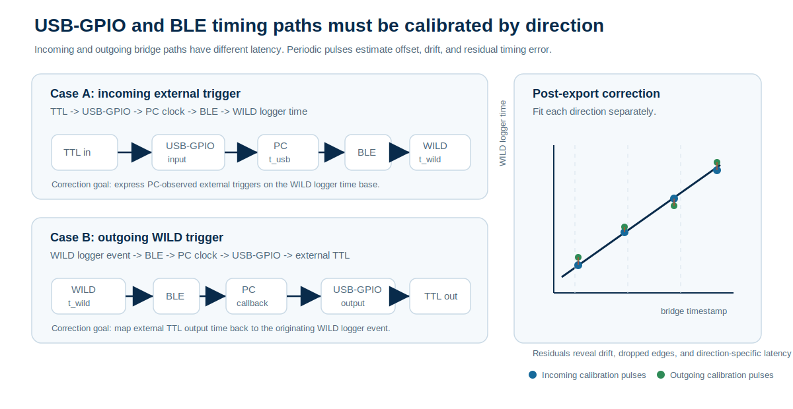

# Data Format

Each WILD device recording session exports a folder with neural data, auxiliary signals, metadata, and optional camera or audio files.

## Files

| File | Verified public handling | Notes |
| --- | --- | --- |
| `amplifier.dat` | Read by `WILD_PreProcess.m` as channel-interleaved 16-bit neural data. | Sample count is computed as `file_bytes / 2 / Nch`, with `Nch` read from `CE_params.bin`. |
| `analogin.dat` | Used as the auxiliary stream for digital inputs, IMU, and timing-related channels. | Public MATLAB scripts read this stream as 16 channels at 1250 Hz for preprocessing and IMU extraction. |
| `digitalin.dat` | Optional digital-input export artifact. | Not every workflow generates a separate file; public trigger generation currently derives digital events from `analogin.dat`. |
| `adc.dat` | ADC or audio stream used by microphone workflows. | Public Python decode scripts read this file as `uint16` mono audio and generate `.wav` or `.mp3` outputs. |
| `misc.dat` | Raw camera payload stream. | Public Python decode scripts convert this file into reviewable video outputs. |
| `time.dat` | Generated sample-index timeline. | Public MATLAB preprocessing writes `0:(Nsamples-1)` as `int32`. |
| `info.rhd` | Intan-compatible metadata header. | Generated from `CE_params.bin` by `WILD_genIntanHeader.m`. |
| `CE_params.bin` | WILD parameter binary for system and DSP settings. | The public docs refer to this as the WILD parameter binary; MATLAB tools use the filename `CE_params.bin`. |

## Export Decoding

The WILD device records compact local streams on its microSD card. During the current SD-card download workflow, WILD_console decodes the on-device recording into analysis-facing files: neural samples are written to `amplifier.dat`, auxiliary and timing words to `analogin.dat`, ADC or audio streams to `adc.dat`, camera payloads to `misc.dat`, and session parameters to the WILD parameter binary.

The exported folder is therefore the decoded public data interface. Raw device storage blocks are not the expected analysis input; downstream MATLAB and Python tools operate on the downloaded files and generate derived outputs such as `info.rhd`, `time.dat`, event files, media files, IMU outputs, and spike-sorting inputs.

{ .wild-readable-figure }

## Time Synchronization

The WILD device keeps high-bandwidth recordings local while WILD_console provides PC-device coordination over BLE. At connection and recording setup, the console synchronizes device state with the PC session and records timing context with the exported dataset.

Timing metadata should be interpreted as a layered system: device sample counts provide the primary sample timeline, PC-device timing coordination supports session-level alignment, and external I/O or digital events provide the most direct alignment path for external cameras, behavior systems, stimulation hardware, and multi-device sessions.

`time.dat` stores the sample-index timeline used by Intan-style workflows, while the WILD parameter binary preserves device-side recording time, hardware version, release image identity, sampling configuration, and DSP settings. External sync lines and digital inputs in `analogin.dat` or generated event files should be retained with the export whenever the experiment depends on cross-device or behavior alignment.

PC-device time synchronization is useful for session organization, export metadata, and cross-device coordination. It should not be treated as a substitute for hardware sync or digital event channels when the analysis requires high-precision alignment.

## Windows Timing Preparation

WILD logger time and PC system time are independent clocks. They can have a fixed offset and a small relative drift during a session. Windows automatic time management is designed to keep the PC close to network time; it does not calibrate drift against the WILD device clock. If Windows applies an automatic correction during an experiment, the PC clock can step abruptly relative to WILD logger time, which creates a discontinuity in PC-side trigger timestamps.

Treat this as a recording prerequisite for any session that uses PC-side timestamps or external timing alignment. For the best PC-side timestamp accuracy on Windows, prepare the acquisition computer before synchronization trials:

1. Disable Windows automatic time adjustment during the recording session, including automatic time setting and automatic time-zone changes.
2. Download and run `TimeCalibrator` on the acquisition computer before the experiment.
3. Use `TimeCalibrator` records together with WILD sync pulses to estimate PC-to-WILD time offset and drift.
4. Apply the offset and drift correction after export before merging USB-GPIO, behavior, camera, stimulation, or multi-device event timestamps with WILD logger time.

This step improves the stability of PC-side timestamps. It does not replace device-side sample timing or direct hardware TTL synchronization when the experiment requires the highest alignment accuracy.

## GPIO-through-USB Trigger Alignment

USB-GPIO and BLE can bridge external equipment and the WILD device, but the bridge has direction-dependent latency. Keep the two cases separate:

- **Incoming external trigger:** `TTL -> USB-GPIO -> PC -> BLE -> WILD`. The PC can timestamp the TTL edge, but the WILD device receives the related BLE command later. The logged WILD event reflects logger-side receive, handling, or sampled digital-input time, not the original PC timestamp unless the delay has been calibrated.
- **Outgoing WILD trigger:** `WILD -> BLE -> PC -> USB-GPIO -> TTL`. The WILD event begins on the logger time base, but the external TTL output appears later after BLE notification, PC scheduling, USB transfer, and GPIO output latency.

These two paths are not interchangeable. The incoming path maps PC-observed trigger time into WILD logger time; the outgoing path maps WILD events into external-equipment time, or is inverted to express external TTL outputs back on the WILD time base. Each direction should be calibrated with pulses that follow the same direction as the real experiment signal.

For high-precision alignment, prefer a hardware TTL split that is recorded directly by WILD and the external system. When a PC/BLE bridge is part of the experiment, treat the USB-GPIO-to-WILD or WILD-to-USB-GPIO delay as a measured timing relationship rather than a constant assumed to be zero. The delay can include GPIO edge detection, USB packet scheduling, operating-system timestamping, BLE connection interval, firmware handling, and the logger sampling edge.

{ .wild-readable-figure }

Recommended synchronization workflow:

1. Choose the bridge direction used by the experiment: incoming `TTL -> PC -> BLE -> WILD`, outgoing `WILD -> BLE -> PC -> TTL`, or a direct hardware TTL split.
2. On the Windows host, disable automatic time adjustment and run `TimeCalibrator` before the session.
3. Add periodic calibration pulses that traverse the same path as the experiment trigger.
4. Record PC/USB-GPIO timestamps, `t_usb`, and export the matching WILD event or digital-input timestamps as logger time, `t_wild = sample_index / fs`.
5. Pair the same pulses across both records and reject missed, duplicated, or ambiguous edges.
6. Fit the direction-specific map. For incoming triggers, use `t_wild = a * t_usb + b`. For outgoing triggers, fit the observed external TTL time against the originating WILD event and invert the map when external timestamps must be expressed in WILD time.
7. Store the direction, TimeCalibrator record, fit coefficients, sync-pulse residuals, release image, WILD_console version, USB-GPIO interface, BLE controller path, and trigger wiring with the exported dataset.

Periodic drift monitoring should continue across the recording, not only at the start. A short pre-session pulse train estimates initial delay, but repeated pulses during the session reveal PC clock drift, USB scheduling changes, logger clock drift, missed edges, or an interrupted connection. After fitting the USB-to-WILD time map, inspect residuals over time. A stable residual trace supports a single affine correction; jumps or curvature indicate that the session needs segmented correction, dropped-pulse review, or exclusion from high-precision timing analysis.

Post-export timestamp correction should be applied before merging external triggers with neural, IMU, audio, camera, or stimulation events. The corrected external trigger time is the timestamp expressed on the WILD logger time base, not the original USB host time. Keep both the raw USB-GPIO log and the corrected WILD-time trigger table so the alignment can be audited later.

## Verified Script Assumptions

The following public assumptions are visible in the repository scripts and should be treated as the current documented behavior unless a release note states otherwise:

- `WILD_PreProcess.m` reads `amplifier.dat` as 16-bit neural samples and uses `CE_params.bin` to determine channel count and sampling rate.
- `time.dat` is written as a monotonically increasing `int32` sample index.
- `WILD_processIMU.m` reads channels `2:10` from `analogin.dat`, assumes a 1250 Hz source rate, and writes `IMU.mat` after resampling to 100 Hz by default.
- `WILD_PreProcess.m` reads channel `1` of `analogin.dat` as a `uint16` digital bitfield and generates `device_event.*.evt` files from its bit transitions.
- `WILD_VideoDecodewAudio.py` reads `adc.dat` as `uint16` audio, converts it to signed audio outputs, and assumes a 160 kHz audio path.
- `WILD_VideoDecodewAudio.py` reads `misc.dat` in `320 * 500` byte frame blocks and writes 320 x 320, 16 Hz decoded video outputs.

Where a file layout depends on a specific release image or modality, report the exact release tag and mode together with the dataset. Do not assume that every export contains every optional modality file.

## Multi-Device and Behavior Alignment

For multi-logger sessions, keep the raw export folder for each device and store merge or sync-estimation outputs alongside the derived files. Useful validation checks include matched `amplifier.dat` duration and file size, stable estimated sample offsets, continuous external TTL or digital events, and no unexpected gaps in camera frames.

Behavior datasets should state whether video, UWB, IMU, and ephys streams are expressed on corrected timestamps. Camera calibration, coordinate transforms, identity curation, and delay correction are part of the dataset metadata, especially for outdoor multi-animal work.

When a behavior pipeline produces files such as `behavior_all.mat`, document whether fields are aligned to corrected timestamps such as `timestamps_corrected` and which correction was used. Post-hoc delay estimation or time warping can help evaluate a session, but it should not replace acquisition-side sync validation.

## Intan-Compatible Layout

WILD exports are arranged to be familiar to users of Intan-style recording folders while preserving WILD-specific metadata for sensors, DSP, stimulation, and camera workflows.

## Best Practice

Keep three folders per experiment:

1. Raw SD export.
2. Converted analysis copy.
3. Downstream results from spike sorting, behavior alignment, or machine-learning analysis.
